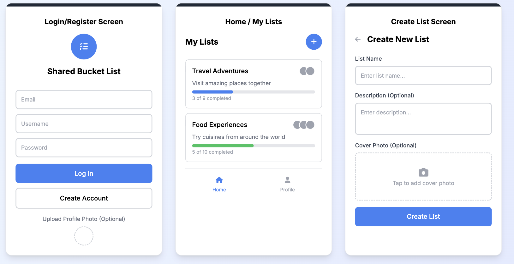
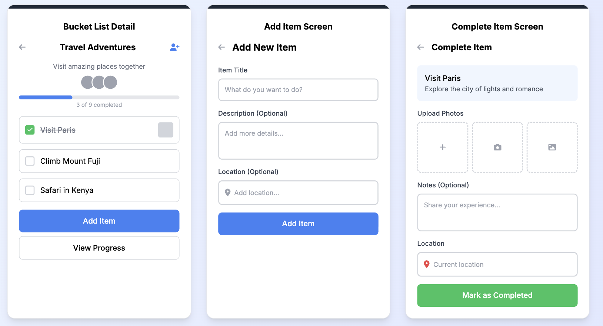
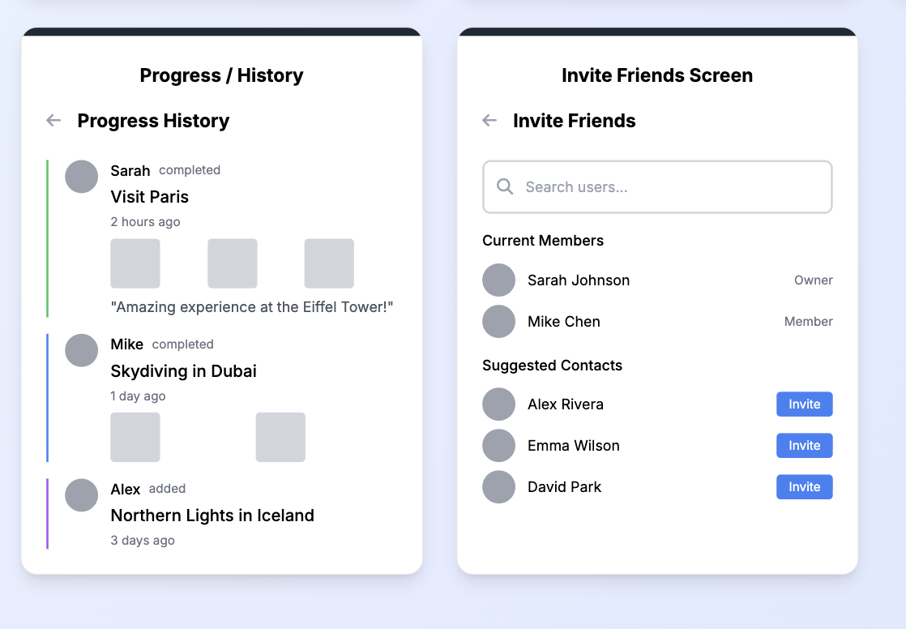

Original App Design Project - README Template
===

# Shared Bucket List

## Table of Contents

1. [Overview](#Overview)
2. [Product Spec](#Product-Spec)
3. [Wireframes](#Wireframes)
4. [Schema](#Schema)

## Overview

### Description

Shared Bucket List is a social mobile app that allows groups of friends, couples, or families to create shared bucket lists together. Users can add goals (trips, restaurants, challenges, experiences), check them off when completed, and capture memories with photos and videos. The app tracks progress and enables real-time collaboration, making it easy to plan and complete adventures together.

### App Evaluation

[Evaluation of your app across the following attributes]
- **Category:** Social
- **Mobile:** Yes, it's a mobile application that leverages unique mobile features including camera for photos/videos, location services for check-ins, push notifications for group updates, and real-time collaboration features. This makes it more than a glorified website.
- **Story:** The app tells the story of "Complete goals with friends" - a highly compelling narrative about shared experiences and memories. It's very shareable and engaging, with clear value proposition that resonates with friend groups, couples, and families.
- **Market:** Target audience includes friend groups, couples, and families who want to do things together. This is a large social/friendship market with a well-defined audience of people who want to plan and complete shared experiences.
- **Habit:** Occasional use - more event-driven than daily habit. Usage depends on activity frequency, but users create content (photos, check-offs) which helps engagement. Moderate habit-forming potential.
- **Scope:** Narrow to moderate scope - core features are well-defined and manageable: shared lists, check-offs, photos, progress tracking, and group collaboration. MVP includes basic shared lists, check-off functionality, photo uploads, and simple progress tracking.

## Product Spec

### 1. User Stories (Required and Optional)

**Required Must-have Stories**

* User can create an account and log in
* User can create a new shared bucket list
* User can invite friends to join a bucket list
* User can add items to a bucket list
* User can view all items in a bucket list
* User can check off completed items
* User can upload photos when completing an item
* User can view progress logs/history of completed items
* User can see which items other group members have completed
* User can view their list of bucket lists

**Optional Nice-to-have Stories**

* User can add location check-ins when completing items
* User can add videos in addition to photos
* User can add comments/reactions to completed items
* User can set due dates for bucket list items
* User can receive push notifications when group members complete items
* User can search for bucket list items
* User can filter items by completion status
* User can persist user information across working sessions
* User can edit or delete bucket list items
* User can leave or remove members from a bucket list

### 2. Screen Archetypes

- [ ] **Login/Register Screen**
* Required User Feature: User can log in or create an account

- [ ] **Home/My Lists Screen**
* Required User Feature: User can view all their bucket lists

- [ ] **Create List Screen**
* Required User Feature: User can create a new shared bucket list

- [ ] **Bucket List Detail Screen**
* Required User Feature: User can view all items in a bucket list, check off items, and see progress

- [ ] **Add Item Screen**
* Required User Feature: User can add items to a bucket list

- [ ] **Complete Item Screen**
* Required User Feature: User can check off an item and upload photos

- [ ] **Progress/History Screen**
* Required User Feature: User can view progress logs and history of completed items

- [ ] **Invite Friends Screen**
* Required User Feature: User can invite friends to join a bucket list

### 3. Navigation

**Tab Navigation** (Tab to Screen)

- [ ] Home/My Lists Tab
- [ ] Profile Tab (optional)

**Flow Navigation** (Screen to Screen)

- [ ] **Login/Register Screen**
  * Leads to **Home/My Lists Screen**
- [ ] **Home/My Lists Screen**
  * Leads to **Bucket List Detail Screen** (when tapping a list)
  * Leads to **Create List Screen** (when tapping create button)
- [ ] **Bucket List Detail Screen**
  * Leads to **Add Item Screen** (when tapping add button)
  * Leads to **Complete Item Screen** (when tapping an item to complete)
  * Leads to **Progress/History Screen** (when tapping progress)
  * Leads to **Invite Friends Screen** (when tapping invite)
- [ ] **Create List Screen**
  * Leads back to **Home/My Lists Screen** (after creating)
- [ ] **Add Item Screen**
  * Leads back to **Bucket List Detail Screen** (after adding)
- [ ] **Complete Item Screen**
  * Leads back to **Bucket List Detail Screen** (after completing)

## Wireframes

### [BONUS] Digital Wireframes & Mockups

### [BONUS] Interactive Prototype

## Schema 

### Models
**User**
| Property | Type   | Description                                  |
|----------|--------|----------------------------------------------|
| username | String | unique id for the user (default field)       |
| password | String | user's password for login authentication     |
| email    | String | user's email address                         |
| profileImage | File | user's profile picture (optional)          |

**BucketList**
| Property | Type   | Description                                  |
|----------|--------|----------------------------------------------|
| listId   | String | unique id for the bucket list (default field)|
| name     | String | name of the bucket list                      |
| description | String | description of the bucket list (optional) |
| createdBy | Pointer<User> | user who created the list            |
| members  | Array<Pointer<User>> | array of users in the group    |
| createdAt | DateTime | when the list was created                 |
| updatedAt | DateTime | when the list was last updated            |

**BucketListItem**
| Property | Type   | Description                                  |
|----------|--------|----------------------------------------------|
| itemId   | String | unique id for the item (default field)       |
| list     | Pointer<BucketList> | the bucket list this item belongs to         |
| title    | String | name/title of the item                       |
| description | String | description of the item (optional)           |
| completed | Boolean | whether the item has been completed          |
| completedBy | Pointer<User> | user who completed the item (if completed)   |
| completedAt | DateTime | when the item was completed (if completed)   |
| photos   | Array<File> | array of photos uploaded when completed      |
| location | GeoPoint | location where item was completed (optional)  |
| createdAt | DateTime | when the item was created                    |

**ProgressLog**
| Property | Type   | Description                                  |
|----------|--------|----------------------------------------------|
| logId    | String | unique id for the log (default field)        |
| item     | Pointer<BucketListItem> | the item this log is for                     |
| user     | Pointer<User> | user who completed the item                  |
| photos   | Array<File> | photos uploaded with completion              |
| location | GeoPoint | location where completed (optional)          |
| notes    | String | optional notes about completion              |
| createdAt | DateTime | when the item was completed                  |

### Networking

- [List of network requests by screen]

**Login/Register Screen**
- `[POST] /users` - Create new user account
- `[POST] /login` - Authenticate user login

**Home/My Lists Screen**
- `[GET] /classes/BucketList?where={"members":{"$inQuery":{"$select":{"query":{"className":"_User","where":{"objectId":"<currentUserId>"}}}}}}` - Retrieve all bucket lists for current user

**Bucket List Detail Screen**
- `[GET] /classes/BucketList/<listId>` - Get bucket list details
- `[GET] /classes/BucketListItem?where={"list":{"__type":"Pointer","className":"BucketList","objectId":"<listId>"}}` - Get all items for a bucket list

**Create List Screen**
- `[POST] /classes/BucketList` - Create new bucket list

**Add Item Screen**
- `[POST] /classes/BucketListItem` - Add new item to bucket list

**Complete Item Screen**
- `[PUT] /classes/BucketListItem/<itemId>` - Mark item as completed and upload photos
- `[POST] /classes/ProgressLog` - Create progress log entry

**Invite Friends Screen**
- `[PUT] /classes/BucketList/<listId>` - Add members to bucket list

**Progress/History Screen**
- `[GET] /classes/ProgressLog?where={"item":{"__type":"Pointer","className":"BucketListItem","objectId":"<itemId>"}}` - Get progress logs for an item
